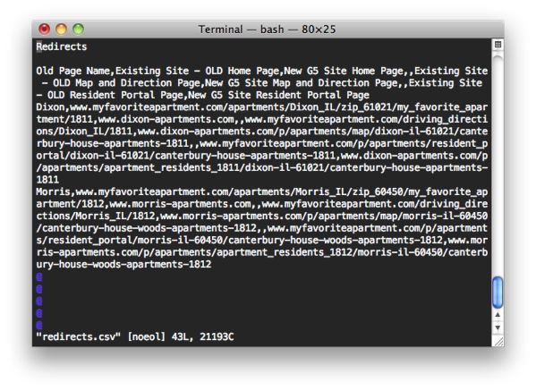
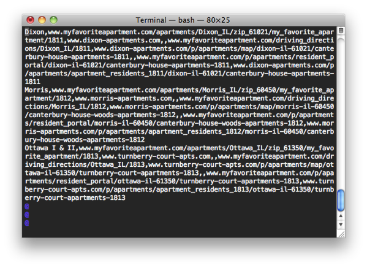
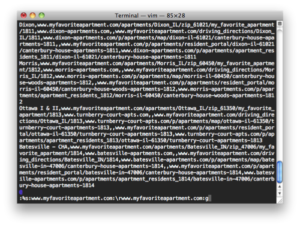
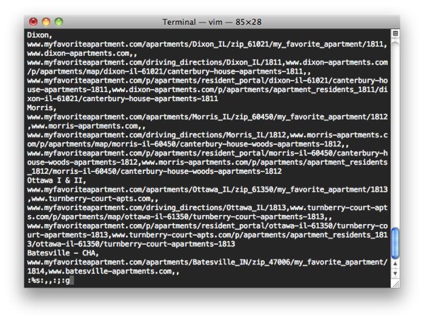
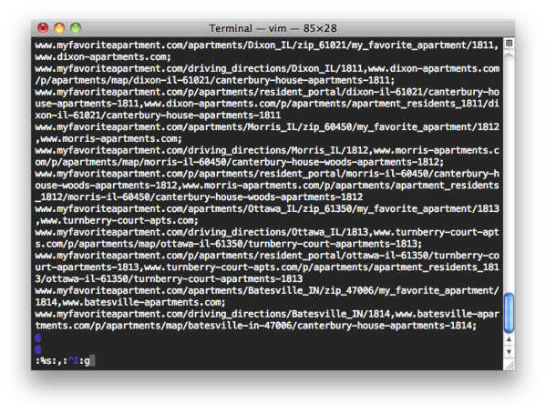
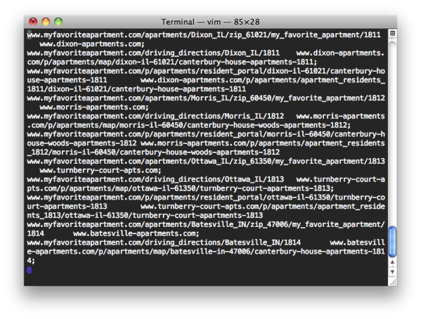

Awhile back at a previous company I got hit with a last-minute request to 
update our Nginx redirect map with data provided in a spreadsheet. Normally 
I only have to do one or two redirect rules at a time. But today I got hit 
with 120 rules – each of which needed data from two cells in the spreadsheet. 
Doing it manually would require 240 cut-n-paste operations – not fun and 
error prone. Oh, and I only had 30-minutes to get this done and up in 
production.

We do these sorts of redirects when a customer changes their domain name. In 
this particular case the customer had a number of locations under one domain 
and they’re now splitting each location out into its own domain. But we don’t 
want visitors to the sites getting 404s due to the URL changing so we put in 
redirect rules to rewrite the request and forward the visitor to the new 
domain.

There’s a bunch of ways to do this, but this is how I did it.

First, a quick explanation of the Nginx redirect map format. There’s not much 
to it:

```
old.example.com new.example.com;
```

That’s the old URL, a space or spaces (or tab), the new URL and a semicolon 
terminating the line.

In this case, each row of the spreadsheet with the redirect data had 7 
columns: the name of the property being redirected, and three URLs that 
needed to be redirected with the destination (i.e. Each location in this 
case only has three pages so there’s only three redirects each). Luckily 
the order of he data is just what I needed for the map.

The first thing I did was a CSV export of the data and opened it up in vi.


The CSV export contained title information for the columns I don’t need so 
let’s just delete those right off.



Ok, now the data is ready to be processed into something I can use. In another 
stroke of luck we can see each redirect pair is separated by two commas since 
the spreadsheet contained an empty column between the three pairs for each 
location. This will make things much easier.



First, let’s get each redirect on its own line in the file. We can search and 
replace for the domain name to be redirected since they’re all the same. We’ll 
search for the domain and replace it as the first thing on its own line with:

```
:%s:www.myfavoriteapartment.com:\rwww.myfavoriteapartment.com:g
```

The % does all lines in the file; the s is for search; the \r is vi-speak for 
newline; and the g at the end is for global so it’ll process the whole line 
rather than the first match it finds on that line. By habit I use : for the 
separator in the search and replace command; you can also (and most people 
do) use /.



Ok, we’re getting there. Next let’s get rid of the double commas and – since 
that’s always at the end of the redirect destination – put a semicolon at the 
end as Nginx requires:

```
:%s:,,:;:g
```



Now we need to deal with the first column of data from the spreadsheet – the 
name of the location. We don’t need this information for the map file so let’s 
just delete it. Each location name is on its own line at this point and ends 
with a comma. So let’s search for lines ending with a comma and delete ‘em:

```
:g:,$:d
```

In this case, the g is for a global operation on all lines; the ,$ matches all 
lines with a , at the end of a line (the $); and the d is for delete.


All we have left is to replace the single remaining comma on each line that 
separates the source and destination URLs. Nginx requires that the separation 
here be one or more spaces. I typically use a tab (although I probably 
shouldn’t – it makes the map file look messy) so let’s do this:

```
:%s:,:^I:g
```

The ^I is the tab character. Nowadays you can usually just press the tab key 
and vi will put in the ^I, but in the old days you had to do control-v and 
control-i to get a tab.



And that’s it.



Now all we got to do is save the file and do a copy and paste of its contents 
into the map file on our production configuration. Of course, you’ll want to 
scroll through the file and make sure it looks correct and do a nginx 
configtest before nginx reload to make sure it’s valid.

&#x269B;
